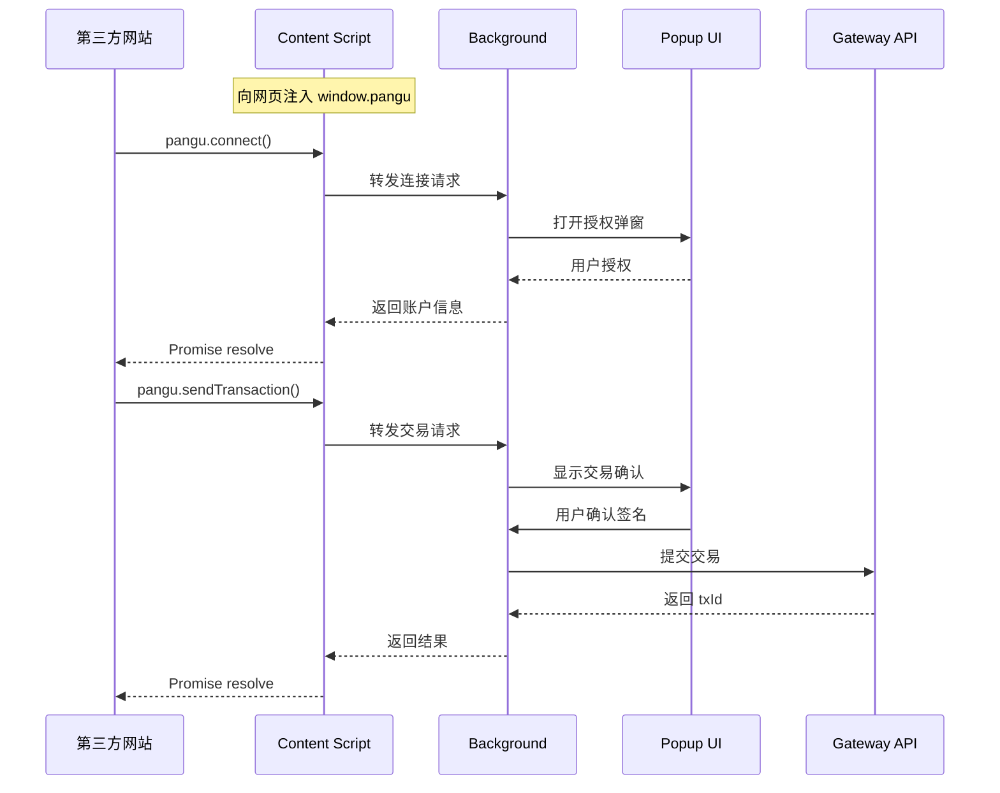

# PanguPay 浏览器钱包扩展 - 完整解决方案

> **项目名称**：PanguPayExtension  
> **创建日期**：2026-01-21  
> **项目定位**：盘古系统轻量级浏览器钱包插件

---

## 📋 目录

1. [项目背景](#1-项目背景)
2. [需求分析](#2-需求分析)
3. [技术调研总结](#3-技术调研总结)
4. [架构设计](#4-架构设计)
5. [功能模块详解](#5-功能模块详解)
6. [代码复用计划](#6-代码复用计划)
7. [目录结构](#7-目录结构)
8. [开发路线图](#8-开发路线图)
9. [技术实现细节](#9-技术实现细节)
10. [网站对接指南](#10-网站对接指南)

---

## 1. 项目背景

### 1.1 现有项目

盘古系统目前包含两个核心项目：

| 项目 | 路径 | 说明 |
|:-----|:-----|:-----|
| **前端钱包** | `TransferAreaInterface/` | 完整 Web 钱包应用，HTML+CSS+TypeScript |
| **后端节点** | `UTXO-Area/` | Go 语言区块链节点系统 |

### 1.2 为什么需要浏览器扩展？

参考 MetaMask、Rabby 等主流钱包：
- 用户无需打开独立网页，点击浏览器图标即可使用
- 第三方 DApp 可以直接调用扩展进行交易
- 更便捷的用户体验，更广泛的生态对接能力

### 1.3 设计原则

- **简洁优先**：只保留核心功能，界面简洁美观
- **代码复用**：最大化复用现有前端项目的核心逻辑
- **技术一致**：沿用原生 HTML+CSS+TypeScript，不引入新框架

---

## 2. 需求分析

### 2.1 核心功能清单

| 序号 | 功能 | 描述 | 优先级 |
|:----:|:-----|:-----|:------:|
| 1 | **登录与注册** | 创建新账户、导入私钥、密码保护 | P0 |
| 2 | **钱包信息查看** | 显示余额、地址列表、多币种资产 | P0 |
| 3 | **快速转账** | 组织内即时确认转账 (TXCer) | P0 |
| 4 | **跨链交易** | BTC/ETH 资产桥接转账 | P1 |
| 5 | **普通转账** | 无组织散户聚合交易 | P1 |
| 6 | **担保组织管理** | 加入/退出担保组织 | P1 |
| 7 | **交易历史** | 查看历史交易记录 | P0 |

### 2.2 功能对比（Web 钱包 vs 扩展）

| 功能 | Web 钱包 | 扩展插件 |
|:-----|:--------:|:--------:|
| 完整资产管理 | ✅ | ✅ 简化版 |
| 多地址管理 | ✅ 完整 | ⚠️ 精简 |
| 交易构造 | ✅ | ✅ |
| 图表报表 | ✅ | ❌ 不需要 |
| DApp 连接 | ❌ | ✅ 核心特性 |
| 组织面板 | ✅ 详细 | ⚠️ 简化 |

---

## 3. 技术调研总结

### 3.1 Chrome 扩展架构 (Manifest V3)

```
扩展组成（源代码）：
├── manifest.json           # 配置文件（权限、入口）
├── src/background/index.ts # Service Worker 入口（构建后输出）
├── src/content/index.ts    # Content Script 入口（构建后输出）
├── src/content/inject.ts   # 注入网页脚本（web_accessible_resources）
├── src/popup/              # 弹窗页面（index.html + main.ts + styles）
└── public/icons/           # 图标资源
```

### 3.2 主流钱包对比

| 特性 | MetaMask | Rabby | PanguPay (规划) |
|:-----|:--------:|:-----:|:---------------:|
| 链类型 | EVM | EVM | UTXO (盘古) |
| 注入对象 | `window.ethereum` | `window.rabby` | `window.pangu` |
| 多链支持 | ✅ | ✅ | ⚠️ 单链 + 跨链桥 |
| 交易模拟 | ❌ | ✅ | ❌ |
| 即时确认 | ❌ | ❌ | ✅ TXCer 特色 |

### 3.3 技术选型决策

| 决策点 | 选择 | 理由 |
|:-------|:-----|:-----|
| **UI 框架** | 原生 HTML+CSS+TS | 与现有项目一致，复用方便 |
| **构建工具** | Vite + @crxjs/vite-plugin | 现代、快速、扩展支持好 |
| **项目结构** | 独立新项目 | 构建独立、发布分离 |
| **代码共享** | 手动复制核心模块 | 简单直接，未来可抽包 |

---

## 4. 架构设计

### 4.1 整体架构图

```
┌─────────────────────────────────────────────────────────────────┐
│                        浏览器环境                                 │
├─────────────────────────────────────────────────────────────────┤
│  ┌──────────────┐    ┌──────────────┐    ┌──────────────────┐   │
│  │   Popup UI   │◄──►│  Background  │◄──►│  Content Script  │   │
│  │  (弹窗界面)   │    │ (Service Worker) │    │   (注入网页)    │   │
│  └──────────────┘    └──────────────┘    └──────────────────┘   │
│         │                   │                      │            │
│         │                   │                      ▼            │
│         │                   │              ┌──────────────┐     │
│         │                   │              │  window.pangu │     │
│         │                   │              │  (网站调用)    │     │
│         │                   │              └──────────────┘     │
│         ▼                   ▼                                   │
│  ┌────────────────────────────────────────────────────────┐     │
│  │                    Core 核心层                          │     │
│  │  ┌──────────┐ ┌──────────┐ ┌──────────┐ ┌──────────┐   │     │
│  │  │signature │ │   api    │ │keyEncrypt│ │ storage  │   │     │
│  │  │  签名    │ │ API客户端 │ │ 密钥加密  │ │ 存储    │   │     │
│  │  └──────────┘ └──────────┘ └──────────┘ └──────────┘   │     │
│  │  ┌──────────┐                                           │     │
│  │  │  types   │                                           │     │
│  │  │ 类型定义  │                                           │     │
│  │  └──────────┘                                           │     │
│  └────────────────────────────────────────────────────────┘     │
└─────────────────────────────────────────────────────────────────┘
                              │
                              ▼
                    ┌──────────────────┐
                    │   Gateway API    │
                    │  (后端节点接口)   │
                    └──────────────────┘
```

> 备注：`txBuilder` 为计划接入模块（来自主钱包的交易构造逻辑），当前扩展核心以签名/加密/API/存储为主。

### 4.2 通信流程



> 当前实现：Background 不会主动拉起弹窗。若未登录/未解锁，会直接返回错误，用户需手动打开插件完成授权/签名。

---

## 5. 功能模块详解

> 说明：本节为功能目标与复用方向说明，实际接入程度以 `src/` 现状为准。

### 5.1 登录与注册模块

```
功能点：
├── 创建新账户
│   ├── 生成 P-256 密钥对
│   ├── 派生钱包地址
│   └── 设置登录密码（PBKDF2 + AES 加密私钥）
├── 导入账户
│   ├── 私钥导入 (Hex 格式)
│   └── 设置登录密码
└── 登录解锁
    ├── 密码验证
    └── 解密私钥到内存
```

**复用代码**：
- `js/utils/signature.ts` - 密钥生成、地址派生
- `js/utils/keyEncryption.ts` - 私钥加密存储

### 5.2 钱包信息查看模块

```
功能点：
├── 总余额展示
│   ├── PGC 余额
│   ├── BTC 余额
│   └── ETH 余额
├── 地址列表
│   ├── 主地址
│   └── 子地址（折叠显示）
└── TXCer 余额（即时到账凭证）
```

**复用代码**：
- `js/services/wallet.ts` - 钱包状态管理
- `js/services/accountQuery.ts` - 余额查询

### 5.3 转账交易模块

```
功能点：
├── 组织内快速转账（UserNewTX / AssignNode）
│   ├── 组织内即时确认（TXCer 签发）
│   └── 收款方可用 TXCer 支付（TXType=1）
├── 跨链交易 (IsCrossChain=true)
│   ├── BTC → PGC
│   └── ETH → PGC
└── 普通转账（NoGuarGroup / ComNode）
    └── 散户聚合交易（TXType=8）
```

**复用代码**：
- `js/services/txBuilder.ts` - 交易构造
- `js/services/transfer.ts` - 转账流程
- `js/utils/signature.ts` - 交易签名

### 5.4 担保组织模块

```
功能点：
├── 查看组织列表
├── 加入组织
│   ├── 选择组织
│   └── 注册地址
└── 退出组织
```

**复用代码**：
- `js/services/group.ts` - 组织管理

### 5.5 交易历史模块

```
功能点：
├── 交易列表
│   ├── 发送记录
│   ├── 接收记录
│   └── 状态标识（成功/待确认/失败）
└── 交易详情
    ├── 交易哈希
    ├── 时间戳
    └── 金额/手续费
```

**复用代码**：
- `js/services/txHistory.ts` - 历史记录管理

---

## 6. 代码复用计划

### 6.1 需要复制的文件

从 `TransferAreaInterface/js/` 复制到 `PanguPayExtension/src/core/`：

| 源文件 | 目标 | 修改程度 |
|:-------|:-----|:--------:|
| `utils/signature.ts` | `core/signature.ts` | 无需修改 |
| `services/txBuilder.ts` | `core/txBuilder.ts` | 无需修改 |
| `utils/keyEncryption.ts` | `core/keyEncryption.ts` | 无需修改 |
| `services/api.ts` | `core/api.ts` | 微调 CORS |
| `utils/bigIntJson.ts` | `core/bigIntJson.ts` | 无需修改 |
| `core/types.ts` | `core/types.ts` | 无需修改 |

### 6.2 需要适配的文件

| 源文件 | 修改内容 |
|:-------|:---------|
| `utils/storage.ts` | localStorage → chrome.storage.local |
| `services/accountPolling.ts` | setInterval → chrome.alarms |

### 6.3 需要新开发的文件

| 文件 | 说明 |
|:-----|:-----|
| `manifest.json` | 扩展配置 |
| `background/index.ts` | Service Worker 入口 |
| `content/index.ts` | Content Script 入口 |
| `content/inject.ts` | 注入 window.pangu |
| `popup/index.html` | 弹窗入口页面 |
| `popup/main.ts` | 弹窗入口脚本 |
| `popup/pages/*` | 弹窗页面 |
| `popup/styles/main.css` | 弹窗样式 |

---

## 7. 目录结构

```
PanguPayExtension/
├── README.md                    # 本文档
├── package.json                 # 项目配置
├── vite.config.ts               # Vite 构建配置
├── tsconfig.json                # TypeScript 配置
├── manifest.json                # Chrome 扩展配置
│
├── public/
│   └── icons/                   # 扩展图标
│       ├── icon16.svg
│       ├── icon48.svg
│       └── icon128.svg
│
├── src/
│   ├── background/              # 后台 Service Worker
│   │   └── index.ts             # 入口
│   │
│   ├── content/                 # 注入脚本
│   │   ├── index.ts             # Content Script 入口
│   │   └── inject.ts            # 注入 window.pangu
│   │
│   ├── popup/                   # 弹窗界面
│   │   ├── index.html           # 入口 HTML
│   │   ├── main.ts              # 入口 TS
│   │   ├── styles/
│   │   │   └── main.css         # 样式
│   │   └── pages/               # 页面
│   │       ├── welcome.ts       # 欢迎页
│   │       ├── unlock.ts        # 解锁页
│   │       ├── create.ts        # 创建页
│   │       ├── import.ts        # 导入页
│   │       ├── home.ts          # 首页（余额）
│   │       ├── send.ts          # 发送页
│   │       ├── receive.ts       # 接收页
│   │       ├── history.ts       # 历史页
│   │       ├── organization.ts  # 组织页
│   │       └── settings.ts      # 设置页
│   │
│   ├── core/                    # 核心逻辑（复用）
│   │   ├── signature.ts         # 签名
│   │   ├── keyEncryption.ts     # 密钥加密
│   │   ├── api.ts               # API 客户端
│   │   ├── storage.ts           # 存储（适配版）
│   │   └── types.ts             # 类型定义
│   │
│   └── sdk/                     # 对外 SDK（规划/可选）
│       └── index.ts             # window.pangu 接口定义
│
└── dist/                        # 构建输出（加载到 Chrome）
```

---

## 8. 开发路线图

### Phase 1: 基础框架 (3-4 天)

- [ ] 初始化项目结构
- [ ] 配置 Vite + Chrome 扩展插件
- [ ] 创建 manifest.json
- [ ] 实现基础 Popup 骨架
- [ ] 复制核心代码模块

### Phase 2: 账户功能 (3-4 天)

- [ ] 创建账户界面
- [ ] 导入账户界面
- [ ] 密码设置与验证
- [ ] 解锁界面
- [ ] chrome.storage 适配

### Phase 3: 钱包展示 (2-3 天)

- [ ] 首页余额展示
- [ ] 多币种显示
- [ ] 地址列表
- [ ] 接收页面（二维码）

### Phase 4: 转账功能 (4-5 天)

- [ ] 发送页面 UI
- [ ] 快速转账实现
- [ ] 跨链交易实现
- [ ] 普通转账实现
- [ ] 交易确认弹窗

### Phase 5: 扩展功能 (2-3 天)

- [ ] 担保组织页面
- [ ] 交易历史页面
- [ ] 设置页面

### Phase 6: DApp 连接 (2-3 天)

- [ ] Content Script 注入
- [ ] window.pangu API
- [ ] 连接授权流程
- [ ] 交易签名流程

### Phase 7: 测试发布 (3-5 天)

- [ ] 端到端测试
- [ ] UI 美化调整
- [ ] Chrome Web Store 提交
- [ ] 文档完善

**总计：19-27 天**

---

## 9. 技术实现细节

### 9.1 Manifest.json 配置

```json
{
  "manifest_version": 3,
  "name": "PanguPay Wallet",
  "version": "1.0.0",
  "description": "盘古系统 UTXO 钱包扩展 - 安全、快速、便捷",
  
  "action": {
    "default_popup": "src/popup/index.html",
    "default_icon": {
      "16": "public/icons/icon16.svg",
      "48": "public/icons/icon48.svg",
      "128": "public/icons/icon128.svg"
    }
  },
  
  "background": {
    "service_worker": "src/background/index.ts",
    "type": "module"
  },
  
  "content_scripts": [
    {
      "matches": ["<all_urls>"],
      "js": ["src/content/index.ts"],
      "run_at": "document_start"
    }
  ],
  
  "permissions": [
    "storage",
    "alarms"
  ],
  
  "host_permissions": [
    "http://47.243.174.71:*/*",
    "http://127.0.0.1:*/*",
    "http://localhost:*/*"
  ],
  
  "icons": {
    "16": "public/icons/icon16.svg",
    "48": "public/icons/icon48.svg",
    "128": "public/icons/icon128.svg"
  },

  "web_accessible_resources": [
    {
      "resources": ["src/content/inject.ts"],
      "matches": ["<all_urls>"]
    }
  ]
}
```

### 9.2 Storage 适配示例

```typescript
// 用法示例（任意模块中）
import { saveAccount, getActiveAccount } from '../core/storage';

await saveAccount(account);
const current = await getActiveAccount();
```

### 9.3 window.pangu API 设计

```typescript
// src/sdk/index.ts - 对外暴露的 API

interface PanguWallet {
  // 连接钱包
  connect(): Promise<{ address: string; accountId: string }>;
  
  // 断开连接
  disconnect(): Promise<void>;
  
  // 获取当前账户
  getAccount(): Promise<{
    address: string;
    accountId: string;
    balance: Record<number, number>;
    organization?: string | null;
  } | null>;
  
  // 发送交易
  sendTransaction(params: {
    to: string;
    amount: number;
    coinType?: number; // 0=PGC, 1=BTC, 2=ETH
    isCrossChain?: boolean;
  }): Promise<{ txId: string; status: string }>;
  
  // 监听账户变化
  on(event: 'accountChanged' | 'disconnect', callback: Function): void;

  // 解除监听
  off(event: 'accountChanged' | 'disconnect', callback: Function): void;
  
  // 检查是否已连接
  isConnected(): Promise<boolean>;
}

// 网站使用示例
// const result = await window.pangu.connect();
// console.log('地址:', result.address);
```

---

## 10. 网站对接指南

### 10.1 检测扩展

```javascript
function isPanguInstalled() {
  return typeof window.pangu !== 'undefined';
}

if (!isPanguInstalled()) {
  alert('请先安装 PanguPay 钱包扩展');
  window.open('https://chrome.google.com/webstore/detail/pangupay/xxx');
}
```

### 10.2 连接钱包

```javascript
async function connectWallet() {
  try {
    const { address, accountId } = await window.pangu.connect();
    console.log('已连接:', address, accountId);
    // 更新 UI 显示已连接状态
  } catch (error) {
    console.error('用户拒绝连接');
  }
}
```

### 10.3 发送交易

```javascript
async function sendPayment(toAddress, amount) {
  try {
    const result = await window.pangu.sendTransaction({
      to: toAddress,
      amount: amount,
      coinType: 0, // PGC
    });
    console.log('交易成功:', result.txId);
  } catch (error) {
    console.error('交易失败:', error.message);
  }
}
```

### 10.4 监听事件

```javascript
// 监听账户切换
window.pangu.on('accountChanged', (newAddress) => {
  console.log('账户已切换:', newAddress);
  // 刷新页面数据
});

// 监听断开连接
window.pangu.on('disconnect', () => {
  console.log('钱包已断开');
  // 清理状态
});
```

---

## 📌 附录

### A. 相关文档

- [TransferAreaInterface 架构](../TransferAreaInterface/docs/02-architecture.md)
- [UTXO-Area 对接指南](../UTXO-Area/docs/04-api-integration.md)
- [Chrome 扩展开发文档](https://developer.chrome.com/docs/extensions/mv3/)

### B. 参考项目

- [MetaMask Extension](https://github.com/MetaMask/metamask-extension)
- [Rabby Wallet](https://github.com/RabbyHub/Rabby)

### C. 设计资源

- 图标规格：16x16, 48x48, 128x128 SVG
- Popup 尺寸：宽 360px，高度自适应（建议 500-600px）

---

> **文档版本**：1.0.0  
> **最后更新**：2026-01-21  
> **维护者**：PanguPay Team
